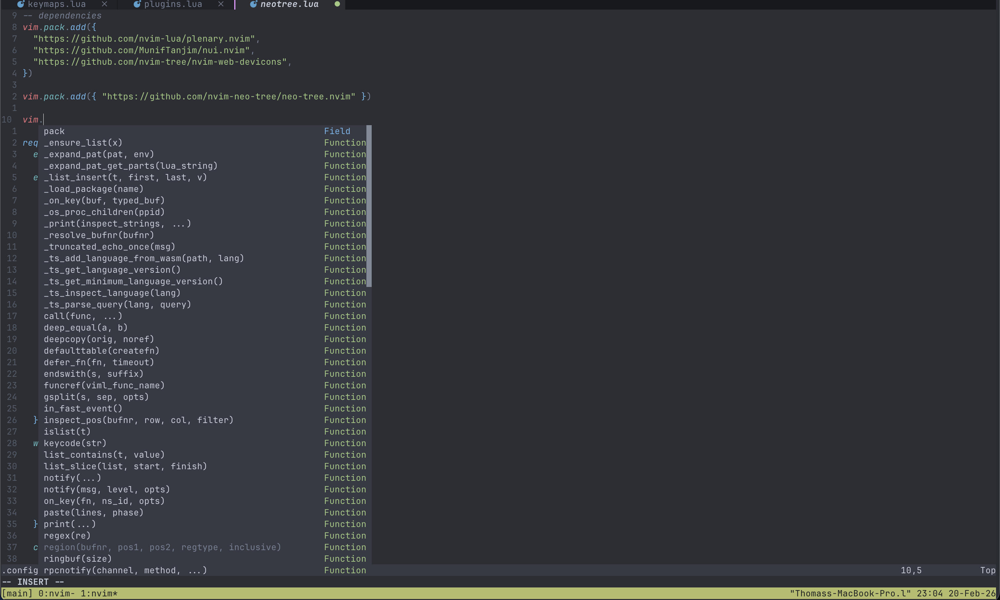
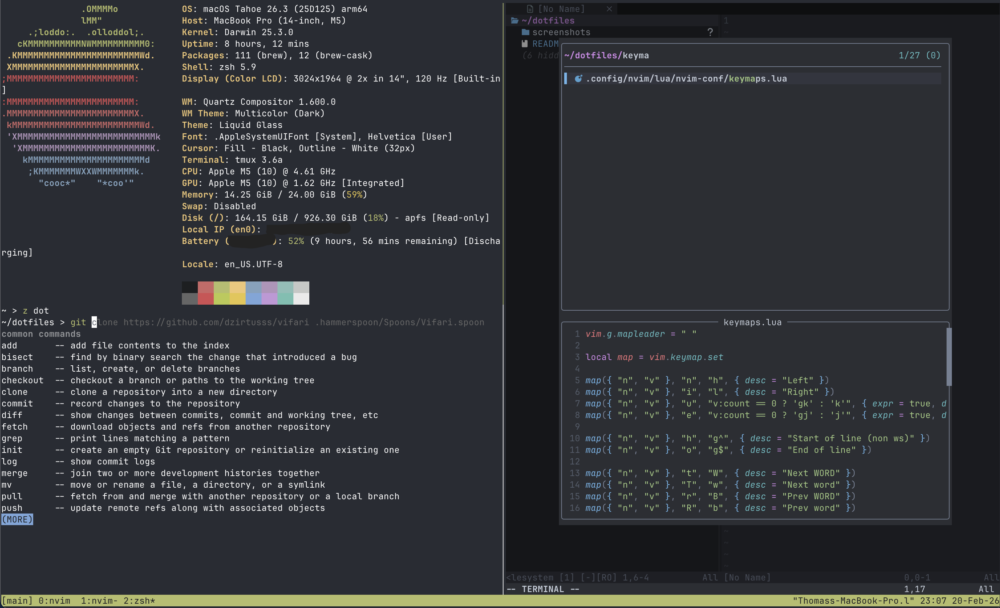

# My dotfiles

## Overview
This repo contains (almost) all my config files managed by [GNU stow](https://github.com/aspiers/stow/), a wonderful tool that symlinks files in a directory to the same locations in your home folder, so you can version control them.

**IMPORTANT: Note that this is only frequently tested on MacOS, and may not work on Linux or Windows without some tweaking**

## Quick start 

```sh 
git clone https://github.com/ThomasReal/Dotfiles
cd dotfiles
stow .
```

## Stow example:
```zsh
~ > lsd -lA dotfiles/.config
drwxr-xr-x thomas staff  96 B Fri Feb 20 12:01:23 2026  kanata
drwxr-xr-x thomas staff 256 B Thu Feb 19 18:25:39 2026  nvim
~ > stow dotfiles
```

See how the nvim and kanata folders are symlinked to dotfiles/:
```zsh
~ > lsd -lA $HOME/.config
.rw-r--r-- thomas staff  14 KB Sun Feb 15 08:58:24 2026  .DS_Store
drwxr-x--x thomas staff 128 B  Tue Feb 17 11:43:54 2026  gh
drwxr-xr-x thomas staff  96 B  Sun Jan  4 09:01:47 2026  ghostty
lrwxr-xr-x thomas staff  26 B  Tue Feb 17 12:07:52 2026  kanata ⇒ ../dotfiles/.config/kanata
drwx------ thomas staff 128 B  Sun Feb 15 21:04:43 2026  karabiner
drwxr-xr-x thomas staff  96 B  Tue Feb 17 10:43:43 2026  neofetch
lrwxr-xr-x thomas staff  24 B  Tue Feb 17 11:37:14 2026  nvim ⇒ ../dotfiles/.config/nvim
drwxr-xr-x thomas staff  96 B  Sat Jan 31 14:18:09 2026  raycast
drwxr-xr-x thomas staff  96 B  Sat Jan 31 17:16:47 2026  uv
drwxr-xr-x thomas staff  96 B  Sat Jan 31 15:46:41 2026  yarn

```

## Features
- Neovim config with lsps and many quality of life plugins 
- Saved tmux sessions across reboots with tmux-continuum and tmux-ressurrect
- A colemak-dh keyboard layout with homerow mods using kanata

## Screenshots





## Requirements:

### Install with your favorite package manager:
- git (comes bundled with MacOS) 
- [stow](https://github.com/aspiers/stow/)

#### Quality of life (optional)
- [zsh-autocomplete](https://github.com/marlonrichert/zsh-autocomplete), [zsh-autosuggestions](https://github.com/zsh-users/zsh-autosuggestions)
- [zsh-fast-syntax-highlighting](https://github.com/zdharma-continuum/fast-syntax-highlighting) (on linux, use zsh-syntax-highlighting or clone the repo manually)
- [zoxide](https://github.com/ajeetdsouza/zoxide)
- [lsd](https://github.com/lsd-rs/lsd) 
- [trash-cli](https://github.com/sindresorhus/trash-cli) (install with npm) (a similar tool comes bundled with MacOS)

#### Neovim 
- [neovim](https://github.com/neovim/neovim) version 0.12 or higher (use [bob](https://github.com/MordechaiHadad/bob))
- [neovide](https://github.com/neovide/neovide)
- [clangd](https://github.com/clangd/clangd), [rust-analyzer](https://github.com/rust-lang/rust-analyzer), [ruff](https://github.com/astral-sh/ruff-lsp), [pyright](https://github.com/microsoft/pyright), [neocmakelsp](https://github.com/neocmakelsp/neocmakelsp), [jdtls](https://github.com/eclipse-jdtls/eclipse.jdt.ls), [bash-language-server](https://github.com/bash-lsp/bash-language-server), [lua-language-server](https://github.com/LuaLS/lua-language-server)
- [clang-format](https://clang.llvm.org/docs/ClangFormat.html), [stylua](https://github.com/JohnnyMorganz/StyLua), [cmake-format](https://github.com/cheshirekow/cmake_format) (for cmake-format, use pip / pipx install cmakelang)

#### Other (optional)
- [llvm](https://github.com/llvm/llvm-project) / [clang](https://clang.llvm.org/) 
- [VulkanSDK](https://vulkan.lunarg.com/sdk/home) (install from the lunarg website)
- [kanata](https://github.com/jtroo/kanata) (and [karabiner-elements](https://github.com/pqrs-org/Karabiner-Elements) on mac)
- [fastfetch](https://github.com/fastfetch-cli/fastfetch)

## Installation

```sh
git clone https://github.com/ThomasReal/Dotfiles
cd dotfiles
stow .
```

## Post installation

### [.zshrc](.zshrc)

Update the 24 first lines to match your preferences (see comments)
```zsh
export PROMPT="%~ > "
export EDITOR="nvim"

# Set to your paths
source /opt/homebrew/opt/zsh-autosuggestions/share/zsh-autosuggestions/zsh-autosuggestions.zsh
source /opt/homebrew/opt/zsh-fast-syntax-highlighting/share/zsh-fast-syntax-highlighting/fast-syntax-highlighting.plugin.zsh
source /opt/homebrew/opt/zsh-autocomplete/share/zsh-autocomplete/zsh-autocomplete.plugin.zsh

# Same thing here
export CC="/opt/homebrew/opt/llvm/bin/clang"     
export CXX="/opt/homebrew/opt/llvm/bin/clang++"  

USE_COLEMAK_ZSH_VI_MODE_BINDINGS=1

# neofetch alternative that isn't deprecated
USE_FAST_FETCH=1

# comment these if you don't want them
alias c="clear"
alias rm="trash"
alias nvim="$HOME/.local/share/bob/nvim-bin/nvim"

alias ls="lsd -A"
alias lsl="lsd -A -l"
```

### Neovim

- My neovim config requires neovim version >= 0.12 because it use the new vim.pack.add function to be able to install packages without a package manager. As of writing this, the latest stable release is still 0.11.6. To get 0.12, I recomment using [bob](https://github.com/MordechaiHadad/bob), a version manager for neovim:
```sh 
bob use nightly
```

The nightly versions are community build and tested newer versions of neovim. They are often newer that the latest stable release, but still very reliable because they have been tested.

- If you want to use neovide, run 
```sh
sudo echo "<your-home-directory>/.local/share/bob/nvim-bin" > /etc/paths.d/bob
```

so that neovide can find the correct neovim binary even when launching the app (.zshrc is ignored if you don't open neovide from the terminal).

- Add plugins by either directly putting
```lua
vim.pack.add({ "https://github.com/author/your-plugin" })
```

in [plugins.lua](.config/nvim/lua/nvim-conf/plugins.lua) or by creating nvim-conf/plugins/your-plugin.lua, which calls vim.pack.add and configures your plugin, then adding
```lua
require("nvim-conf.plugins.your-plugin")
```

to plugins.lua

- Remove the colemak mappings in [keymaps.lua](.config/nvim/lua/nvim-conf/keymaps.lua) and [neotree.lua](.config/nvim/lua/nvim-conf/plugins/neotree.lua) if you don't use colemak.

- Change the end of [nvim-lspconfig.lua](.config/nvim/lua/nvim-conf/plugins/nvim-lspconfig.lua) to your list of lsps.
```lua
vim.lsp.enable("ltex")
vim.lsp.enable("ruby_lsp")
```

### Tmux

If you use tmux but don't have the tpm (the Tmux Plugin Manager), run 
```sh
git clone https://github.com/tmux-plugins/tpm ~/.tmux/plugins/tpm
```

Then run
```sh
tmux source ~/.tmux.conf
```

If tmux is running to refresh it.
Finally, press prefix I (capital i) to reload tmux plugins and you should now have tmux-ressurrect and tmux-continuum. Press prefix ctl-s to save your tmux environement and prefix ctl-r to restore it after reboots.

### Kanata 

[Kanata](https://github.com/jtroo/kanata) is a "cross-platform software keyboard remapper for Linux, macOS and Windows". See the git repo for more details.

To install and use kanata on linux or windows, I believe you just need to install it with a package manager and have 
```sh 
kanata --cfg path/to/dotfiles/.config/kanata/config.kbd  --quiet
```
constantly running in another window.

If your are on mac, however, it is a little more complicated. First, install it along with karabiner elements:
```sh 
brew install kanata karabiner-elements
```

You need karabiner elements because MacOS makes remapping keys very difficult for security reasons, so kanata on MacOS uses something called a virtual HID device which karabiner-elements comes with. (karabiner elements is another keyboard remapper).

Then, open the karabiner elements app. It will prompt you to grant it permissions, give them. If it asks whether you want it to launch every time you power on your computer, say no. After that, fully quit the app. It runs as a background process, click on the icon on the top-right of the screen and select "Quit". You can then either run 
```sh
sudo kanata --cfg path/to/dotfiles/.config/kanata/config.kbd --quiet
```
in another window **OR** if you want kanata to run all the time without retyping the command on every reboot, do the following

Create the file /Library/LaunchDaemons/com.kanata.plist with the following contents:
```html
<?xml version="1.0" encoding="UTF-8"?>
<!DOCTYPE plist PUBLIC "-//Apple//DTD PLIST 1.0//EN"
 "http://www.apple.com/DTDs/PropertyList-1.0.dtd">
<plist version="1.0">
  <dict>
    <key>Label</key>
    <string>com.kanata</string>

    <key>ProgramArguments</key>
    <array>
      <string>/opt/homebrew/bin/kanata</string>
      <string>-c</string>
      <string>/Users/<username>/.config/kanata/config.kbd</string>
      <string>-q</string>
    </array>

    <key>RunAtLoad</key>
    <true/>

    <key>KeepAlive</key>
    <true/>

    <key>StandardOutPath</key>
    <string>/tmp/kanata.out</string>

    <key>StandardErrorPath</key>
    <string>/tmp/kanata.err</string>
  </dict>
</plist>
```
**Don't forget to replace \<username\> with your username.**
And run
```sh
sudo launchctl load /Library/LaunchDaemons/com.kanata.plist
```

Now restart your computer and **after logging in and waiting ~4 seconds**, your keyboard should be remapped.


## Uninstall
```sh 
stow -D path/to/dotfiles
```
